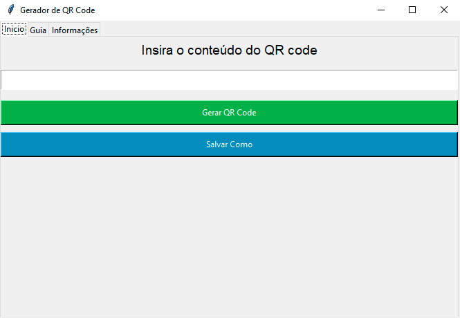
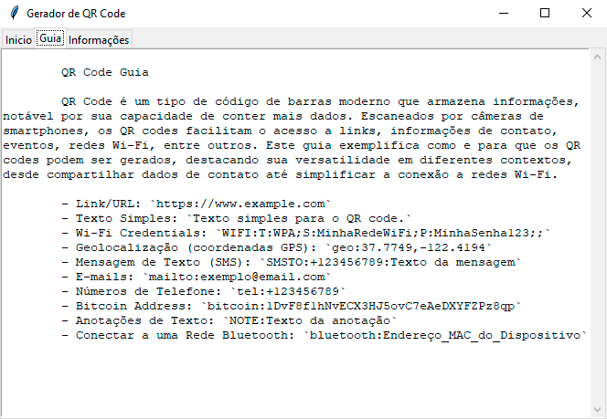

# QR-Code-Generator

English | [Português](README_pt.md)

This is a simple QR Code generator with a graphical interface, developed in Python using the Tkinter library. It allows you to easily create QR codes for various purposes, such as links, plain text, Wi-Fi information, GPS coordinates, and more.

[](https://github.com/kensdy/QR-Code-Generator)

## How to Install

1. Clone the repository:

    ```bash
    git clone https://github.com/kensdy/QR-Code-Generator.git
    ```

2. Navigate to the project directory:

    ```bash
    cd QR-Code-Generator
    ```

3. Install dependencies using `pip`:

    ```bash
    pip install -r requirements.txt
    ```
    
4. Run the main script:

    ```bash
    python main.py
    ```

## How to Use

1. Run the Python script `main.py`.
2. The graphical interface will be displayed with three tabs: "Home," "Guide," and "Additional Information."
3. In the "Home" tab, enter the desired content for the QR Code (link, text, etc.).
4. Click the "Generate QR Code" button to create the QR Code.
5. Use the "Save As" button to choose the location and name of the file to save the QR Code in PNG format.

## Examples of QR Code Content

In the "Guide" tab, you will find examples of different types of content that can be used to generate QR Codes, such as links, plain text, Wi-Fi information, GPS coordinates, text messages (SMS), emails, phone numbers, Bitcoin addresses, text annotations, and connection to a Bluetooth network.

## Additional Information

### Video Demonstration

Watch a video demonstration of the program on YouTube:

[](https://www.youtube.com/watch?v=OGrucDV3FcI)

In the video, you will see how the QR Code generator works, how to enter content, generate QR Codes, and save the results.

### Screenshots

#### Home Screen



The home screen allows you to input the desired content for the QR Code and generate it easily.

#### Example Guide



In the guide, you will find examples of different types of content that can be used to generate QR Codes.

### Author

- [Kensdy](https://github.com/kensdy)

### License

This project is distributed under the [MIT License](LICENSE).
